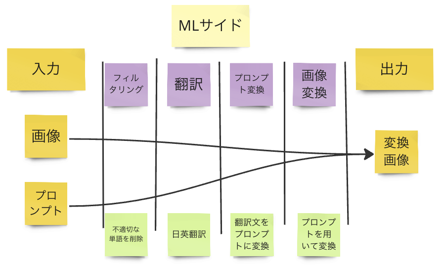
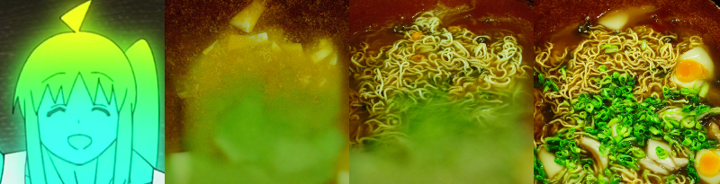

# MorPhoto
## 概要
MorPhotoはユーザーがプロンプトを用いてアイコン画像を自由に変換することができるサービスです
## 全体の流れ

## 実行方法
### 準備 : トークンの設定
```bash
echo 'OPENAI_API_KEY=your_openai_api_key' >> .env
echo 'HUGGING_FACE_TOKEN=your_huggingface_token' >> .env
```
### 実行 + テスト
```bash
poetry install
poetry run python icon_conversion.py
poetry run pytest # テスト
```

## 変換結果
### 変換例1 : 新海誠風

### 変換例2 : 花火大会

### 変換例3 : ラーメン
